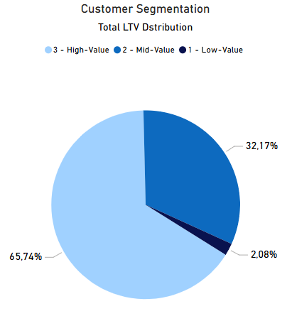
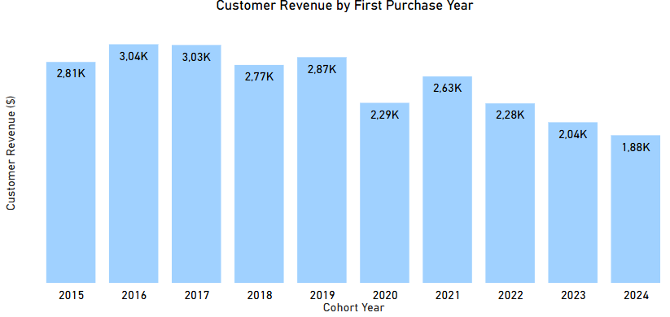
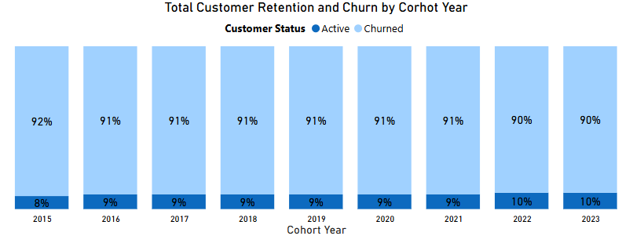

# Sales Analysis - Contoso

## Overview
Conducted an analysis of customer behavior, retention trends, and lifetime value for an e-commerce business to enhance customer loyalty and increase overall revenue.

## Business Questions
1. **Customer Segmentation**: Who are our highest-value customers?

2. **Cohort Analysis**: How do revenue trends vary across different customer cohorts?

3. **Retention Analysis**: Which customers have become inactive or stopped purchasing recently?

## Analysis Approach

### 1. Customer Segmentation Analysis

- Segmented customers by total Lifetime Value (LTV)
- Grouped them into High-, Mid-, and Low-value segments
- Calculated essential metrics, including total revenue contribution

 Query: [1_customer_segmentation.sql](1_customer_segmentation.sql)

**Visualization:**

 **Key Findings:**

- High-value segment (25% of customers) drives 66% of revenue ($135.4M)
- Mid-value segment (50% of customers) generates 32% of revenue ($66.6M)
- Low-value segment (25% of customers) accounts for 2% of revenue ($4.3M)

 **Business Insights**

- The top 25% of customers bring in most of the revenue (66%). Keep them engaged with special offers, loyalty rewards, and personalized service.

- The middle 50% of customers generate a solid share of revenue (32%). Encourage them to spend more through targeted promotions and product recommendations.

- The bottom 25% of customers bring in very little revenue (2%). Design re-engagement campaigns and price-sensitive promotions to increase how often they buy.

### 2. Cohort Analysis

- Tracked revenue and customer count across cohorts
- Grouped cohorts by the year of first purchase
- Evaluated retention trends at the cohort level

 Query: [2_cohort_analysis.sql](/2_cohort_analysis.sql)

**Visualization:**

 **Key Findings:**
 - Revenue per customer has been steadily declining over time
 - Customers acquired in 2022–2024 underperform compared to earlier cohorts

    Note: While total revenue is growing, this is primarily driven by a larger customer base—not by increased customer value

 **Business Insights**
- Customer lifetime value (LTV) has been declining over time, indicating potential issues with customer quality or engagement.

- A noticeable drop in customer acquisition occurred in 2023, raising concerns about growth.

- With both LTV and acquisition decreasing, the company is at risk of a future revenue decline if trends continue.

### 3. Customer Retention

- Identified customers likely to churn
- Reviewed recent purchase behavior
- Computed metrics at the customer level

Query: [3_retention_analysis.sql](3_retention_analysis.sql)

**Visualization:**

 **Key Findings:**  

- Customer churn tends to level off around 90% after 2–3 years, showing a consistent long-term trend.

- All cohort groups exhibit low retention rates (8–10%), pointing to widespread retention challenges rather than isolated issues.

- Recent cohorts (2022–2023) are following similar churn trends, implying that without strategic changes, upcoming cohorts will likely experience the same retention problems.

 **Business Insights:**  
- Most churn happens within the first 1–2 years, so improving early engagement through onboarding incentives, loyalty rewards, and personalized offers can help boost long-term retention.

- High-value churned customers are worth reactivating. Focused win-back campaigns are likely to deliver better results than broad efforts.

- Predicting and acting on churn risk early using customer behavior signals can help reduce losses by keeping at-risk users engaged.

## Strategic Recommendations

1. **Maximize Value from Existing Customers**

   Launch a VIP program for high-value customers, create personalized upgrade paths for mid-value segments, and use price-sensitive promotions to boost spending from low-value customers.

2. **Revive and Retain Recent Cohorts**

   Target 2022–2024 cohorts with personalized re-engagement offers, and apply proven strategies from older high-performing cohorts to improve their long-term value.

3. **Reduce Churn Through Early Intervention**
   
   Strengthen engagement during the first 1–2 years with onboarding incentives and loyalty rewards, and proactively identify at-risk customers using churn signals to prevent drop-off.

## Technical Details
- **Database:** PostgreSQL
- **Analysis Tools:** PostgreSQL, DBeaver, PGadmin
- **Visualization:** Power BI
